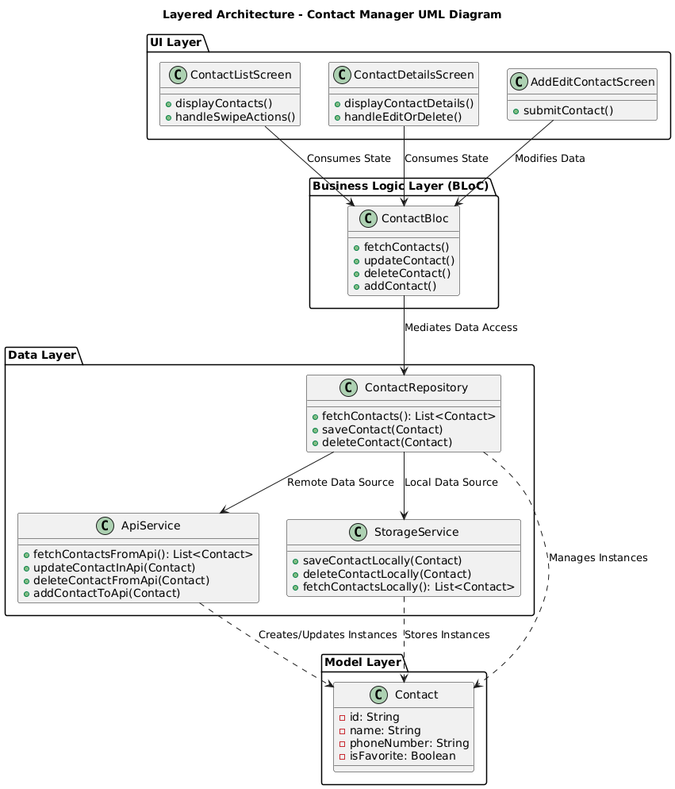
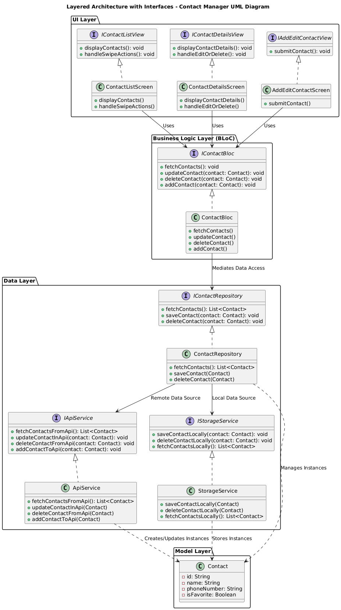

# Contact Manager App 👥

A modern and feature-rich contact management application built using Flutter. This app allows users to manage their contacts with ease, leveraging a robust architecture and seamless integration of persistent storage and API services.

---

## Features 🌟

1. **Comprehensive Contact Management** 👨🏻‍💼
   - Add, view, edit, delete, and favorite contacts.
   - Support for dynamic loading of contacts.

2. **Interactive User Interface** 📱
   - Built with responsive Flutter widgets such as `ListView` and `Slidable`.
   - Offers interactive features like swipe actions and floating action buttons.

3. **State Management** 🔄
   - Implements the **BLoC (Business Logic Component)** pattern for efficient state and event handling.
   - Supports asynchronous operations for fetching, updating, and saving contact data.

4. **Persistent Storage** 💾
   - Local storage functionality ensures offline usability.
   - Stores user preferences like favorited contacts.

5. **API Integration** 🌍
   - Provides functionality to fetch, update, add, and delete contacts from an external API.

6. **Error Handling** ❗️
   - Displays user-friendly error messages for network issues and other unexpected errors.

---

## Getting Started 🚀🚀🚀

### Prerequisites

Ensure you have the following installed on your development machine:
- [Flutter SDK](https://flutter.dev/docs/get-started/install)
- A code editor such as [Visual Studio Code](https://code.visualstudio.com/) or [Android Studio](https://developer.android.com/studio)
- [Git](https://git-scm.com/)

### Installation

1. Clone the repository:
   ```bash
   git clone https://github.com/mamadfrhi/ContactManager.git
   cd contact-manager
   ```

2. Install dependencies:
   ```bash
   flutter pub get
   ```

3. Run the app:
   ```bash
   flutter run
   ```

---

## Architecture 🛠️🛠️🛠️

The application is built using a clean and modular architecture, adhering to best practices for scalability and maintainability:

1. **BLoC Pattern**:
   - Manages the state and business logic of the app.
   - Ensures a clear separation of concerns between UI and backend logic.

2. **Modular Design**:
   - Components such as storage, API services, and UI widgets are decoupled for reusability.

3. **Error Handling**:
   - Implements custom error states to provide clear feedback to users.

---

## Architecture Overview 🛠️

### Current Architecture (In-App)
The current architecture follows a layered design with **UI Layer**, **Business Logic Layer (BLoC)**, and **Data Layer**. It adheres to clean code principles but can be further improved for scalability and flexibility.



### Suggested Architecture (Future Improvement)
To adhere strictly to **SOLID principles** and **Clean Architecture**, interfaces have been introduced for all key components. This ensures better abstraction, testability, and separation of concerns.




By introducing interfaces, the architecture achieves:
1. **Loose Coupling**: Improved flexibility for unit testing and swapping components.
2. **SOLID Principles**: Better adherence to Dependency Inversion (D) and Interface Segregation (I).
3. **Clean Code**: Components are modular, reusable, and easier to maintain.

We recommend transitioning to the suggested architecture for future versions of the app.

---

## Key Components 🔑

1. **Contact List**:
   - Displays all contacts with options to mark as favorite or delete.
   - Supports pagination and dynamic loading for larger datasets.

2. **Contact Details**:
   - View detailed information about a contact.
   - Options to edit or delete directly from the details page.

3. **Add/Edit Contact**:
   - Forms for creating or updating contact information.

4. **Favorites Management**:
   - Easily access and manage favorite contacts.

5. **Persistent Storage**:
   - Offline storage ensures data availability even without an internet connection.

6. **API Service**:
   - Provides seamless synchronization with remote APIs for contact management.


--- 

## Contact

📧📧📧 For questions or suggestions, feel free to reach out at [mamad.frhi@gmail.com](mailto:mamad.frhi@gmail.com).


---